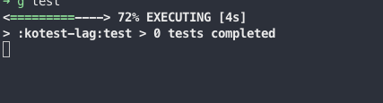

## start the app

- Change something in the tests. maybe add a variable to AppTest.kt
- run the tests `./gradlew test`

### Results

- 3s to start showing running AppTest.

  
- another 2s with `executing AppTest`. Which is a very small test.

  
- In total, there seems to be 14 seconds delay before the first test starts executing.

- Total runtime 17s, which seems quite a lot. For example vitest in JS, can run 30 tests within sub second range.

  

using intel macbook pro 2019. 16gb ram